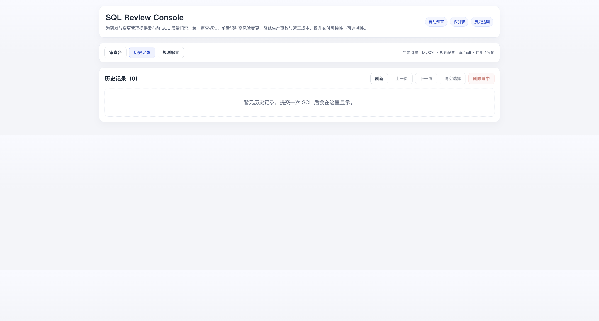
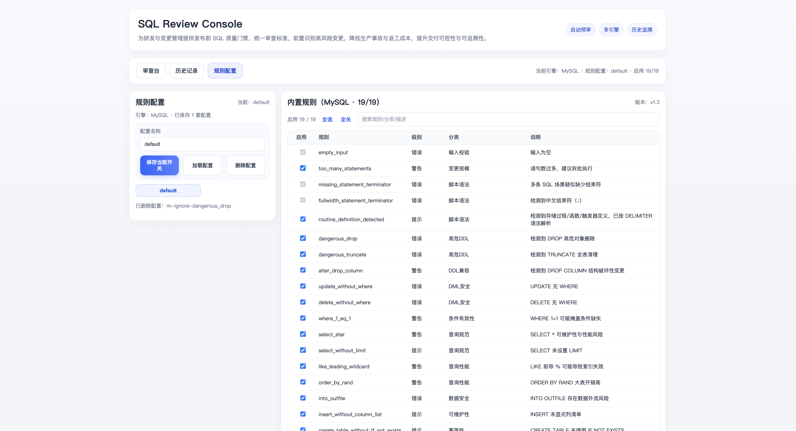

# SQL Review Studio

Language: [中文](#readme-zh) | [English](#readme-en)

## 产品预览 / Product Preview

以下截图展示核心界面与典型使用流程，便于首次阅读时快速建立整体认知。

### 1. 审查台（提交 SQL 与风险输出）


用于提交 SQL（粘贴或上传）并查看结构化审查结果（错误/警告/提示与建议）。

### 2. 历史记录（审查留痕与回溯）



用于分页查看历史审查记录，支持筛选、删除与结果回溯，满足审计与复盘场景。

### 3. 规则配置（规则开关与策略管理）



用于按引擎管理规则策略，支持保存/加载配置并批量调整规则开关。

<a id="readme-zh"></a>
## 中文

### 产品定位
SQL Review Studio 是一个面向研发、DBA 和数据团队的 SQL 审查平台，用于在发布前识别风险、给出修复建议，并沉淀可追溯的审查记录。

### 产品设计初衷

- 降低数据库变更事故：将高风险语句在上线前暴露并提示修复方向
- 统一多引擎审查入口：以一致的流程支持 `MySQL / PostgreSQL / MongoDB`
- 标准化审查流程：支持规则配置、历史留痕、问题复盘，减少人治差异

### 核心能力

- SQL 输入方式：支持直接粘贴与脚本文件上传
- 规则引擎：按引擎隔离规则，支持开启/关闭、保存/加载配置
- 结果输出：提供错误/警告/提示分级与可执行修复建议
- 历史管理：持久化每次审查记录，支持分页、详情、删除、恢复到工作区

### 技术栈

- 前端：`Vue 3 + Vite`
- 后端：`Go`（HTTP API）
- 存储：`SQLite`（通过本机 `sqlite3` 命令访问）
- 工程化：`dev.sh` 统一管理前后端启动、健康检查、日志与清理

### 目录结构

- `dev.sh`：一键启动/停止脚本（同时管理前后端，默认 SQLite 路径为 `data/sql_review.db`）
- `logs`：运行日志目录（`backend.log`、`frontend.log`，可由 `LOG_DIR` 覆盖）
- `data`：持久化数据目录（可由 `DATA_DIR` 覆盖）
- `backend/main.go`：API 入口（健康检查、规则列表、检查、历史记录）
- `backend/analyzer.go`：MySQL 规则引擎
- `backend/engine_analyzer.go`：多引擎路由（MySQL / PostgreSQL / MongoDB）
- `backend/storage.go`：SQLite 持久化存储
- `backend/analyzer_test.go`、`backend/storage_test.go`：核心单元测试
- `frontend/package.json`：Vite 工程配置
- `frontend/src/App.vue`：主界面（审查台 / 历史记录 / 规则配置）
- `frontend/src/assets/main.css`：样式文件

### 推荐启动方式（统一脚本）

```bash
cd sql-review-studio
./dev.sh start
```

常用命令：

```bash
./dev.sh stop
./dev.sh restart
./dev.sh status
./dev.sh logs
./dev.sh clean
./dev.sh doctor
```

`dev.sh` 特性：

- 启动前自动释放目标端口占用（后端 `8080`、前端 `5173`）
- 自动健康检查（后端 `/api/v1/health`、前端首页）
- `clean` 清理 `.run`、`logs`、旧 PID/日志、前端缓存（保留 `data`）
- `doctor` 检查依赖、权限、端口占用与目录状态

### 历史持久化（SQLite）

每次检查结果都会写入 SQLite，默认路径：

- 直接运行后端：`backend/data/sql_review.db`
- 使用 `./dev.sh`：`sql-review-studio/data/sql_review.db`

可通过环境变量修改：

- `DATA_DIR`（默认 `sql-review-studio/data`）
- `SQL_REVIEW_DB_PATH`（完整文件路径，优先级高于 `DATA_DIR`，例如 `/tmp/sql_review.db`）

前端提供：

- 历史记录列表（分页）
- 历史删除（单条 / 批量）
- 历史详情弹窗
- 从历史恢复到工作区继续分析
- 规则配置保存/加载/删除（本地持久化）

规则引擎增强：

- 检查多语句场景结束符缺失（`;`）风险
- 识别存储过程/函数/触发器并按 `DELIMITER` 语法解析
- 多引擎差异化规则（MySQL / PostgreSQL / MongoDB）

多引擎架构（当前已具备基础骨架）：

- 统一接口：`AnalyzeByEngine(engine, content, options)`
- 引擎规则隔离：`RulesForEngine(engine)`
- 请求与历史记录都保存 `engine`
- 前端规则配置按引擎隔离存储

后续迭代建议：

- 规则分层：公共规则 + 引擎专属规则 + 业务自定义规则
- 数据增强：逐步引入执行计划、对象元信息、发布窗口信息，进一步降低误差

### API

#### `GET /api/v1/health`
健康检查。

#### `GET /api/v1/rules`
获取规则版本与规则列表。

#### `POST /api/v1/check`
支持两种输入：

1. `application/json`

```json
{
  "sql": "SELECT * FROM t;",
  "engine": "mysql",
  "disabledRules": ["select_without_limit"]
}
```

2. `multipart/form-data`

- `file`：脚本文件（`.sql` / `.txt` / `.js`）
- `engine`：`mysql | postgresql | mongodb`
- `disabledRules`：JSON 数组字符串，例如 `["select_without_limit"]`

返回包含：

- `requestId`、`historyId`、`engine`、`source`、`fileName`
- `disabledRules`（本次关闭规则）
- `summary`（错误/警告/提示）
- `issues`（详细风险）
- `advice`（自动建议）

#### `GET /api/v1/history?limit=20&offset=0`
查询历史列表（分页）。

#### `GET /api/v1/history/{id}`
查询历史详情（含 SQL 原文、风险细项）。

#### `DELETE /api/v1/history`
批量删除历史记录，示例：

```json
{
  "ids": [101, 102, 103]
}
```

#### `DELETE /api/v1/history/{id}`
删除单条历史记录。

### 后端测试

```bash
cd backend
GOCACHE=$(pwd)/.cache/go-build go test ./...
```

### 前端构建

```bash
cd frontend
npm run build
npm run preview
```

<a id="readme-en"></a>
## English

### Product Positioning
SQL Review Studio is a SQL review platform for engineering, DBA, and data teams. It helps identify release risks before execution, provides remediation guidance, and keeps auditable review records.

### Design Intent

- Reduce database change incidents by catching risky statements before release
- Unify multi-engine review with one workflow across `MySQL / PostgreSQL / MongoDB`
- Standardize review operations with configurable rules and traceable history

### Core Capabilities

- Input: direct SQL paste and script file upload
- Rules: engine-isolated rule sets with enable/disable and save/load config support
- Output: structured error/warning/info findings with actionable suggestions
- History: persistent records with list/detail/delete and restore-to-workspace flow

### Tech Stack

- Frontend: `Vue 3 + Vite`
- Backend: `Go` (HTTP API)
- Storage: `SQLite` (accessed via local `sqlite3` command)
- Operations: `dev.sh` for startup, health checks, logs, and cleanup

### Project Structure

- `dev.sh`: One-command start/stop script for frontend and backend (default SQLite path: `data/sql_review.db`)
- `logs`: Runtime logs (`backend.log`, `frontend.log`, overridable via `LOG_DIR`)
- `data`: Persistent data directory (overridable via `DATA_DIR`)
- `backend/main.go`: API entry (health, rules, check, history)
- `backend/analyzer.go`: MySQL rule engine
- `backend/engine_analyzer.go`: Multi-engine router (MySQL / PostgreSQL / MongoDB)
- `backend/storage.go`: SQLite persistence layer
- `backend/analyzer_test.go`, `backend/storage_test.go`: core unit tests
- `frontend/package.json`: Vite project config
- `frontend/src/App.vue`: Main UI (Review / History / Rule Config)
- `frontend/src/assets/main.css`: styles

### Recommended Startup (Unified Script)

```bash
cd sql-review-studio
./dev.sh start
```

Common commands:

```bash
./dev.sh stop
./dev.sh restart
./dev.sh status
./dev.sh logs
./dev.sh clean
./dev.sh doctor
```

`dev.sh` features:

- Frees target ports before startup (backend `8080`, frontend `5173`)
- Runs automatic health checks (backend `/api/v1/health`, frontend home page)
- `clean` removes `.run`, `logs`, stale PID/log files, and frontend runtime cache (keeps `data`)
- `doctor` checks dependencies, permissions, port usage, and directory state

### Persistent History (SQLite)

Every review result is persisted to SQLite. Default paths:

- When backend runs directly: `backend/data/sql_review.db`
- When using `./dev.sh`: `sql-review-studio/data/sql_review.db`

Environment overrides:

- `DATA_DIR` (default `sql-review-studio/data`)
- `SQL_REVIEW_DB_PATH` (full file path, higher priority than `DATA_DIR`, e.g. `/tmp/sql_review.db`)

Frontend capabilities:

- Paginated history list
- History deletion (single / batch)
- History detail modal
- Restore a history record back to workspace for re-analysis
- Rule config save/load/delete (local persistence)

Rule engine enhancements:

- Detects missing statement terminators (`;`) in multi-statement SQL
- Detects procedures/functions/triggers and parses with `DELIMITER` semantics
- Engine-specific rules for MySQL / PostgreSQL / MongoDB

Multi-engine architecture (already scaffolded):

- Unified interface: `AnalyzeByEngine(engine, content, options)`
- Engine rule isolation: `RulesForEngine(engine)`
- `engine` is stored for both requests and history
- Frontend rule configs are stored per engine

Planned iteration directions:

- Layered rules: shared rules + engine-specific rules + custom business rules
- Better context: execution plans, object metadata, and release-window metadata

### API

#### `GET /api/v1/health`
Health check.

#### `GET /api/v1/rules`
Get rule version and rule list.

#### `POST /api/v1/check`
Supports two input formats:

1. `application/json`

```json
{
  "sql": "SELECT * FROM t;",
  "engine": "mysql",
  "disabledRules": ["select_without_limit"]
}
```

2. `multipart/form-data`

- `file`: script file (`.sql` / `.txt` / `.js`)
- `engine`: `mysql | postgresql | mongodb`
- `disabledRules`: JSON array string, e.g. `["select_without_limit"]`

Response includes:

- `requestId`, `historyId`, `engine`, `source`, `fileName`
- `disabledRules` (rules disabled for this run)
- `summary` (error/warning/info)
- `issues` (detailed risks)
- `advice` (auto suggestions)

#### `GET /api/v1/history?limit=20&offset=0`
List history records (paginated).

#### `GET /api/v1/history/{id}`
Get history details (includes raw SQL and issue details).

#### `DELETE /api/v1/history`
Batch delete history records:

```json
{
  "ids": [101, 102, 103]
}
```

#### `DELETE /api/v1/history/{id}`
Delete one history record.

### Backend Tests

```bash
cd backend
GOCACHE=$(pwd)/.cache/go-build go test ./...
```

### Frontend Build

```bash
cd frontend
npm run build
npm run preview
```
